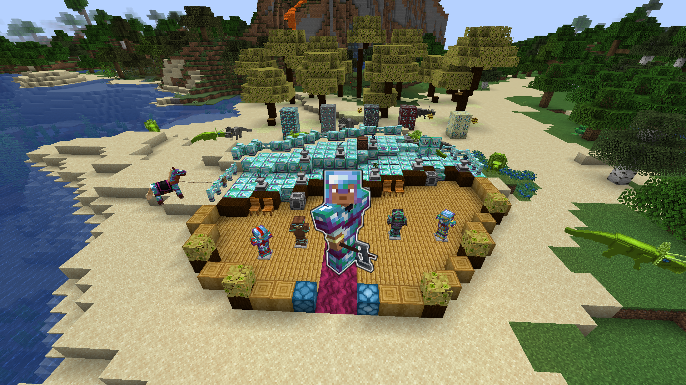
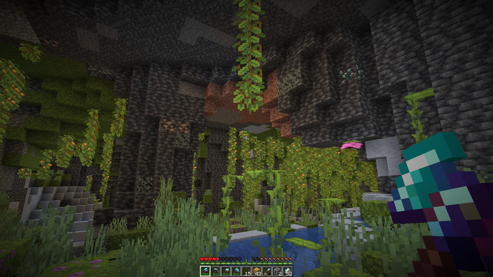
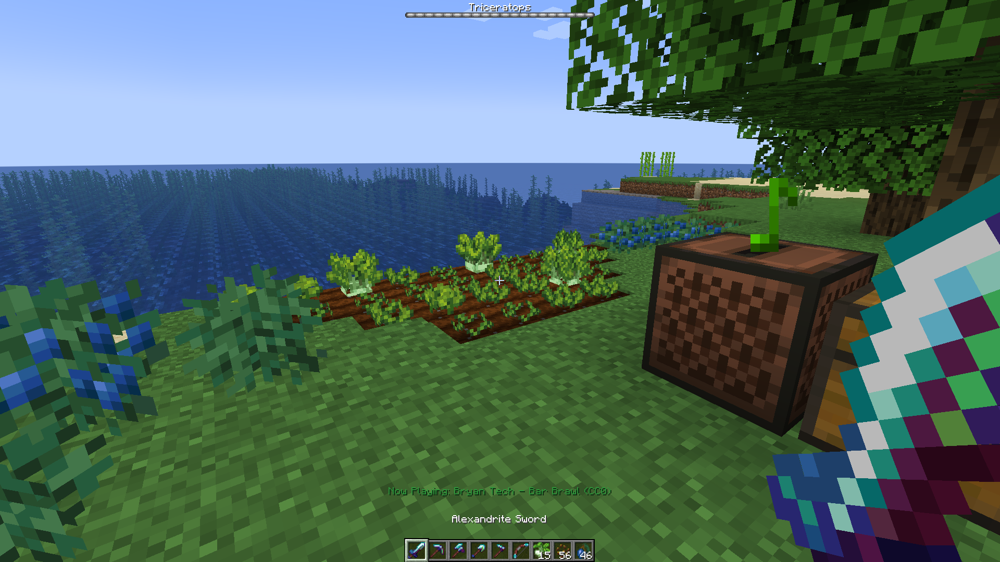
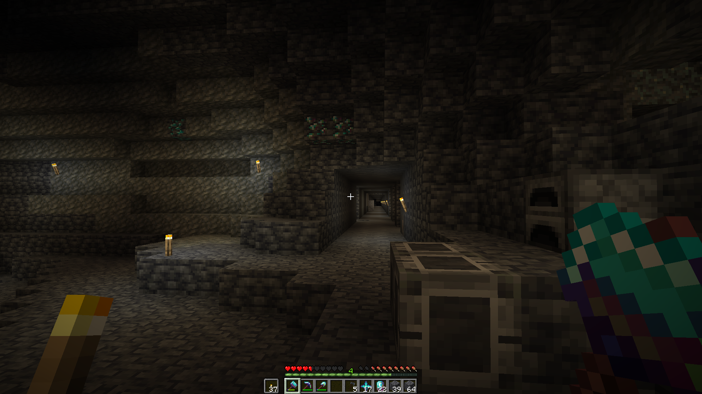

# TutorialMod

---

## Overview

TutorialMod is a Minecraft mod that adds a variety of items, blocks, features, and entities. It's the result of a
14h course made by Kaupenjoe that I follow to improve my skills in Minecraft modding.
> Made in 3 weeks (Thanks to the playlist of Kaupenjoe
> at https://www.youtube.com/playlist?list=PLKGarocXCE1GspJBXQEGuhazihZCSSLmK)

---

## Table of Contents

- [Features](#features)
- [Technologies Used](#technologies-used)
- [Demo](#demo)
- [License](#license)

---

## Features

- **Setup & Build**: Workspace configuration for Forge, mod JAR generation, and GitHub integration.
- **Custom Blocks & Items**: Creation of simple and advanced blocks and items (tools, armor, food items, fuels).
- **Recipes & Loot Tables**: Definition of custom crafting recipes and loot tables.
- **Automated Datagen**: Generation of models, blockstates, and localization files using data generators.
- **BlockStates & Components**: Implementation of complex properties using block states and custom components.
- **Events & Listeners**: Use of Forge’s event system to respond to game actions and events.
- **Nature & World Generation**: Addition of crops, flowers, trees, ores, geodes, custom structures, and biomes.
- **Block Entities & GUI**: Complex blocks with tile entities, menu interfaces, JEI compatibility, energy systems, and
  fluid storage.
- **Custom Mobs & Entities**: Creation of creatures, projectiles, rideable and tameable mobs, with inventories,
  animations, and sounds.
- **Enchantments & Potions**: Introduction of new enchantments and potions, with custom recipes.
- **Audio & UI Enhancements**: Custom sounds, music, animated textures, and models.
- **Version Upgrades**: Forge project migration and updates (e.g., 1.21 → 1.21.3).

---

## Technologies Used

- **Minecraft Forge 1.21.x**: Java modding API for Minecraft, handling events, registries, and mod compatibility.
- **Java & Gradle**: Modular project structure, build automation via Gradle, core logic written in Java.
- **IDE IntelliJ**: IDE support via MinecraftDev plugin for Forge source integration, code navigation,
  and autocomplete.
- **Data‑Gen**: Automated generation of JSON assets and localization files.
- **JEI**: Integration with "Just Enough Items" to support GUI recipe viewing.

---

## Demo

---

## License

This project is licensed under the MIT License - see the [LICENSE.md](LICENSE-FORGE.md) file for details.